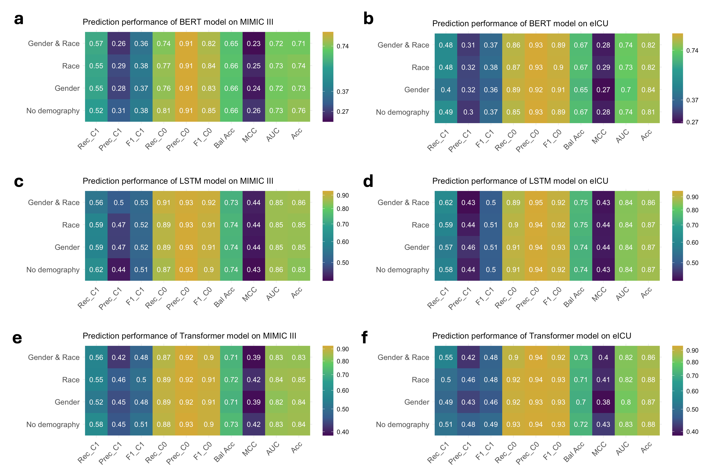
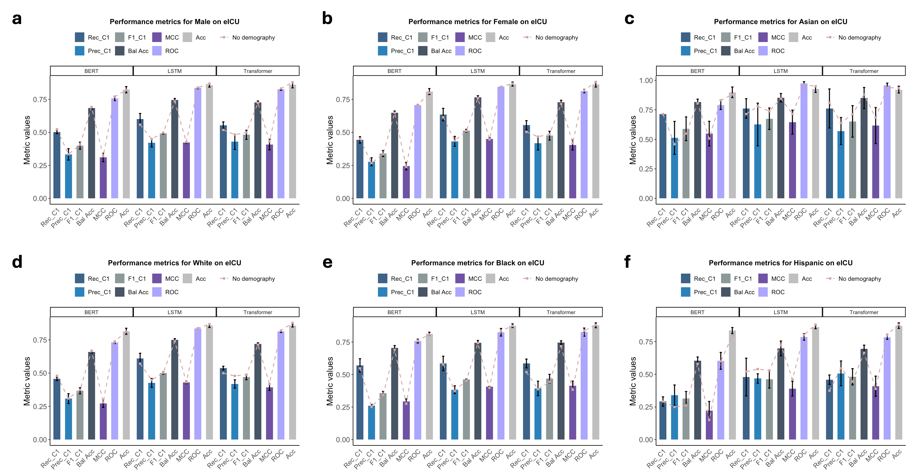

## Results ##
**Demographic Effects on Model Performance**

**Figure S1: Performance evaluation of models on the MIMIC III and eICU dataset based on demographic variables. Each subfigure (a-f) presents the performance of four configurations for each model and dataset. The color scale maps the metric values to intensity. The mean performance scores are calculated from three independent trials. Rec, Prec, F1, Bal Acc, MCC, AUC, and Acc represent recall, precision, F1 score, balanced accuracy, Mathews correlation coefficient, the area under receiver operating curve, and accuracy, respectively. C0 and C1 represent class 0 (survival) and class 1 (death), respectively.**

 
**Performance Comparison Based on Subgroups**

**Figure S2: Comparison of model performance on eICU data for subgroups when demographic information is added as a single attribute. Subfigures a and b present the performance for male and female patients, respectively, when gender is added. Subfigures c to f present performance for Asian, White, Black, and Hispanic patients, respectively, when race is added. Bars represent the mean metric values (from three independent trials) after adding gender or race information, with error bars showing standard deviations. C1 represents class 1 (death). The dashed line shows results for ``no demography'' setting.**

 
**Prediction Change Analysis**

<table>
  <tr>
    <th colspan="7">MIMIC III (Death to Survival)</th>
    <th colspan="7">MIMIC III (Survival to Death)</th>
  </tr>
  <tr>
    <th>Models</th>
    <th colspan="2">Correct</th>
    <th colspan="2">Incorrect</th>
    <th colspan="2">Survival Rate (Training Set)</th>
    <th colspan="2">Correct</th>
    <th colspan="2">Incorrect</th>
    <th colspan="2">Death Rate (Training Set)</th>
  </tr>
  <tr>
    <th></th><th>Male</th><th>Female</th><th>Male</th><th>Female</th><th>Male</th><th>Female</th>
    <th>Male</th><th>Female</th><th>Male</th><th>Female</th><th>Male</th><th>Female</th>
  </tr>
  <tr><td>BERT</td><td>3.17</td><td>3.54</td><td>0.98</td><td>1.07</td><td></td><td></td><td>1.28</td><td>1.76</td><td>7.03</td><td>7.32</td><td></td><td></td></tr>
  <tr><td>LSTM</td><td>2.67</td><td>3.5</td><td>0.89</td><td>0.97</td><td>88.86</td><td>87.44</td><td>0.59</td><td>0.35</td><td>1.34</td><td>1.07</td><td>11.14</td><td>12.56</td></tr>
  <tr><td>Transformer</td><td>2.69</td><td>5.07</td><td>1.76</td><td>2.29</td><td></td><td></td><td>1.22</td><td>1.23</td><td>3.47</td><td>2.71</td><td></td><td></td></tr>

  <tr><th colspan="7">eICU (Death to Survival)</th><th colspan="7">eICU (Survival to Death)</th></tr>
  <tr>
    <th>Models</th>
    <th colspan="2">Correct</th>
    <th colspan="2">Incorrect</th>
    <th colspan="2">Survival Rate (Training Set)</th>
    <th colspan="2">Correct</th>
    <th colspan="2">Incorrect</th>
    <th colspan="2">Death Rate (Training Set)</th>
  </tr>
  <tr>
    <th></th><th>Male</th><th>Female</th><th>Male</th><th>Female</th><th>Male</th><th>Female</th>
    <th>Male</th><th>Female</th><th>Male</th><th>Female</th><th>Male</th><th>Female</th>
  </tr>
  <tr><td>BERT</td><td>6.1</td><td>6.97</td><td>1.63</td><td>1.4</td><td></td><td></td><td>0.47</td><td>0.6</td><td>3.36</td><td>2.93</td><td></td><td></td></tr>
  <tr><td>LSTM</td><td>1.43</td><td>2.77</td><td>0.53</td><td>0.6</td><td>88.73</td><td>88.31</td><td>0.43</td><td>0.35</td><td>1.71</td><td>1</td><td>11.27</td><td>11.69</td></tr>
  <tr><td>Transformer</td><td>2.98</td><td>2.77</td><td>1.36</td><td>0.9</td><td></td><td></td><td>0.76</td><td>0.97</td><td>2.42</td><td>5.28</td><td></td><td></td></tr>
</table>

**Table S4: Percentages of change in prediction for gender groups. The table shows the percentages of correct and incorrect prediction changes by the models from death to survival and from survival to death in MIMIC III and eICU.**

 

<table>
  <tr>
    <th colspan="13">MIMIC III (Death to Survival)</th>
    <th colspan="13">MIMIC III (Survival to Death)</th>
  </tr>
  <tr>
    <th>Models</th>
    <th colspan="4">Correct</th>
    <th colspan="4">Incorrect</th>
    <th colspan="4">Survival Rate (Training Set)</th>
    <th colspan="4">Correct</th>
    <th colspan="4">Incorrect</th>
    <th colspan="4">Death Rate (Training Set)</th>
  </tr>
  <tr>
    <th></th>
    <th>Asian</th><th>White</th><th>Black</th><th>Hispanic</th>
    <th>Asian</th><th>White</th><th>Black</th><th>Hispanic</th>
    <th>Asian</th><th>White</th><th>Black</th><th>Hispanic</th>
    <th>Asian</th><th>White</th><th>Black</th><th>Hispanic</th>
    <th>Asian</th><th>White</th><th>Black</th><th>Hispanic</th>
    <th>Asian</th><th>White</th><th>Black</th><th>Hispanic</th>
  </tr>
  <tr><td>BERT</td><td>3.17</td><td>4.35</td><td>7.13</td><td>10</td><td>1.59</td><td>1.06</td><td>2.64</td><td>1.21</td><td></td><td></td><td></td><td></td><td>0.53</td><td>1.5</td><td>0.92</td><td>0.3</td><td>8.47</td><td>6.85</td><td>1.95</td><td>2.12</td><td></td><td></td><td></td><td></td></tr>
  <tr><td>LSTM</td><td>3.7</td><td>3.02</td><td>7.13</td><td>9.7</td><td>6.88</td><td>0.84</td><td>1.03</td><td>1.82</td><td>87.81</td><td>88.95</td><td>93.04</td><td>92.62</td><td>0</td><td>0.49</td><td>0.11</td><td>0</td><td>0</td><td>1.37</td><td>0.69</td><td>0</td><td>12.19</td><td>11.05</td><td>6.96</td><td>7.38</td></tr>
  <tr><td>Transformer</td><td>3.7</td><td>2.68</td><td>4.71</td><td>3.94</td><td>1.06</td><td>1.46</td><td>2.76</td><td>2.73</td><td></td><td></td><td></td><td></td><td>3.17</td><td>0.72</td><td>0.23</td><td>0</td><td>0.53</td><td>2.16</td><td>1.61</td><td>0.3</td><td></td><td></td><td></td><td></td></tr>

  <tr><th colspan="13">eICU (Death to Survival)</th><th colspan="13">eICU (Survival to Death)</th></tr>
  <tr>
    <th>Models</th>
    <th colspan="4">Correct</th>
    <th colspan="4">Incorrect</th>
    <th colspan="4">Survival Rate (Training Set)</th>
    <th colspan="4">Correct</th>
    <th colspan="4">Incorrect</th>
    <th colspan="4">Death Rate (Training Set)</th>
  </tr>
  <tr>
    <th></th>
    <th>Asian</th><th>White</th><th>Black</th><th>Hispanic</th>
    <th>Asian</th><th>White</th><th>Black</th><th>Hispanic</th>
    <th>Asian</th><th>White</th><th>Black</th><th>Hispanic</th>
    <th>Asian</th><th>White</th><th>Black</th><th>Hispanic</th>
    <th>Asian</th><th>White</th><th>Black</th><th>Hispanic</th>
    <th>Asian</th><th>White</th><th>Black</th><th>Hispanic</th>
  </tr>
  <tr><td>BERT</td><td>6.02</td><td>5.17</td><td>5.86</td><td>6.4</td><td>0</td><td>1.06</td><td>0.88</td><td>0.53</td><td></td><td></td><td></td><td></td><td>0</td><td>0.8</td><td>0.81</td><td>1.07</td><td>2.31</td><td>3.9</td><td>4.38</td><td>3.47</td><td></td><td></td><td></td><td></td></tr>
  <tr><td>LSTM</td><td>1.85</td><td>1.85</td><td>2.15</td><td>1.6</td><td>0</td><td>0.52</td><td>0.74</td><td>0.53</td><td>87.68</td><td>88.31</td><td>90.22</td><td>88.55</td><td>0</td><td>0.71</td><td>0.47</td><td>0.27</td><td>3.7</td><td>2.37</td><td>1.41</td><td>1.87</td><td>12.32</td><td>11.69</td><td>9.78</td><td>11.45</td></tr>
  <tr><td>Transformer</td><td>0.46</td><td>2.55</td><td>4.11</td><td>1.87</td><td>0.93</td><td>1.02</td><td>0.81</td><td>0.27</td><td></td><td></td><td></td><td></td><td>0.46</td><td>0.96</td><td>0.54</td><td>0.8</td><td>0.93</td><td>3.17</td><td>1.62</td><td>1.87</td><td></td><td></td><td></td><td></td></tr>
</table>

**Table S5: Percentages of change in prediction for race groups. The table shows the percentages of correct and incorrect prediction changes by the models from death to survival and from survival to death in MIMIC III and eICU.**

 
